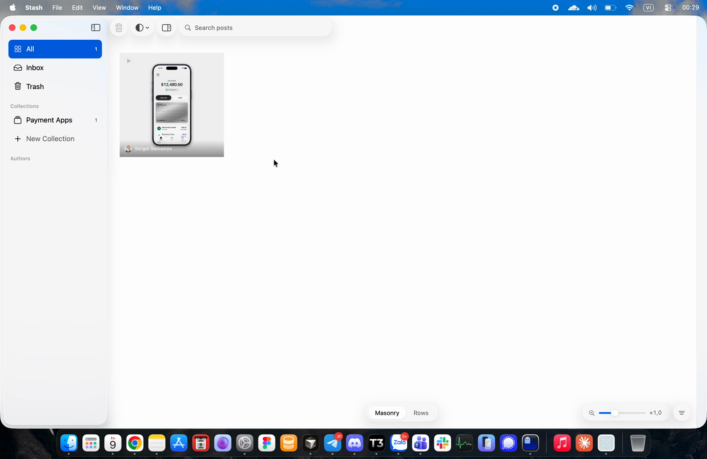

# Stash

A private visual library for X posts. Save a post from Chrome with one click, then browse
everything you saved in a native macOS gallery.

[](docs/demo.mov)

▶ [Watch the demo](docs/demo.mov) (19 s): save a post on X, then find it in the Mac app.

## What it does

- **Save from X.** The extension adds a Stash button next to X's bookmark button on every
  post, including quote posts. Photos, videos and GIFs are saved at full size.
- **Browse like a gallery.** The Mac app shows your posts in a masonry grid where every image
  and video keeps its own shape, or in justified rows. Hover a video to preview it.
- **Organize.** Sort posts into collections (drag them onto the sidebar), find them in
  Inbox until you do, search by text or author, and restore anything from Trash.
- **Stays yours.** Everything is stored on your Mac and in your browser. Stash doesn't sign in
  to X or import your X bookmarks; it only keeps posts you save with its button.

## Getting started

You need macOS 15 or later, Xcode 26, Node 22 and pnpm.

**1. Run the Mac app.** Open `macos/Stash.xcodeproj` and press Run (⌘R).

**2. Build the extension.**

```sh
cd extension
pnpm install
pnpm dev      # dev build in dist/chrome-mv3-dev, rebuilds on save
pnpm build    # production build in dist/chrome-mv3
```

**3. Load it in Chrome.** Go to `chrome://extensions`, turn on **Developer mode**, click
**Load unpacked** and pick `extension/dist/chrome-mv3-dev` (or `chrome-mv3` for the
production build). Pin **Stash for X** from the puzzle-piece menu.

**4. Save a post.** Click the Stash button under any post on x.com. It shows up in the Mac app
within a few seconds while the app is running, or the next time you open it.

## How it fits together

```
x.com ──save──▶ extension storage ──sync queue──▶ Mac app (127.0.0.1:47811) ──▶ library.json
```

```
stash/
├── macos/       SwiftUI app (Xcode project)
├── extension/   Chrome extension (WXT, React, Tailwind, shadcn/ui)
└── docs/        Demo video
```

### Mac app

| File | Role |
| --- | --- |
| `Services/LocalBookmarkService.swift` | Reads and writes the library file |
| `Services/BookmarkStore.swift` | App state the views observe; every change goes through it |
| `Services/ExtensionBridge.swift` | Local endpoint the extension syncs to |
| `Views/GalleryView.swift`, `MasonryLayout.swift`, `JustifiedLayout.swift` | The gallery |

### Extension

| Path | Role |
| --- | --- |
| `src/entrypoints/x.content/` | Adds the Stash button to posts and reads the post when clicked |
| `src/entrypoints/x-media.content.ts` | Reads media details (video files, original sizes) from the responses X's page already loads. It makes no requests of its own. |
| `src/entrypoints/popup/` | Toolbar popup: search, open and remove saved posts, sync status |
| `src/lib/bookmarks.ts` | Saved posts in `chrome.storage.local`, plus the queue of changes to sync |
| `src/lib/sync.ts` | Delivers the queue to the Mac app (run by `src/entrypoints/background.ts`) |

## Data and sync

**On the Mac**, the library is one JSON file:
`~/Library/Application Support/com.example.stash/library.json` (the folder is named after the
app's bundle id). It lives outside the app, so updates and reinstalls don't touch it.

- Every save replaces the file atomically, so a crash can't leave it half written.
- A file the app can't read is moved aside as `library-unreadable-*.json`, never overwritten.
- A file written by a newer version of Stash opens read-only.

**In Chrome**, saved posts live in the extension's local storage, which survives browser
restarts and extension updates.

**Between the two**, the extension saves locally first and queues each change. Its background
script sends the queue to the Mac app whenever the app is running: right away, when you open the
popup, and every minute otherwise. Nothing is lost while the app is closed.

- The app listens on 127.0.0.1 only and refuses requests from web pages.
- Removing a post in the browser moves it to the app's Trash.
- Changes made in the app (collections, Trash) stay in the app. Sync is one way for now.

### Moving to the cloud

Both sides are set up so a server can slot in without reworking them:

- The local routes already match the planned API (`PUT /v1/bookmarks/{id}`,
  `DELETE /v1/bookmarks/{id}`), so the extension switches by changing `APP_URL` in `sync.ts`
  and adding auth.
- Every record in the Mac library carries `updatedAt`, and deletions leave a `deletedAt`
  marker. That's what a sync engine needs to merge changes in both directions. It would run
  next to `LocalBookmarkService`, so the views don't change.

## Bookmark format

Both sides use the same JSON, so a server only has to store and return it:

```json
{
  "id": "1843000000000000001",
  "url": "https://x.com/handle/status/1843000000000000001",
  "author": { "name": "Maya Chen", "handle": "mayabuilds", "avatarURL": "https://…" },
  "text": "…",
  "media": [
    { "kind": "photo", "url": "https://pbs.twimg.com/media/…", "posterURL": null, "width": 1200, "height": 675 },
    { "kind": "video", "url": "https://video.twimg.com/….mp4", "posterURL": "https://pbs.twimg.com/…", "width": 720, "height": 1280 }
  ],
  "postedAt": "2026-10-08T12:00:00.000Z",
  "savedAt": "2026-10-08T14:00:00.000Z",
  "collectionIDs": [],
  "trashedAt": null,
  "updatedAt": "2026-10-08T14:00:00.000Z",
  "deletedAt": null
}
```

- `kind` is `photo`, `video` or `gif`. For videos and GIFs, `url` is the mp4 and `posterURL`
  the still frame.
- `width` and `height` can be `null` if X didn't provide them and the image hadn't loaded yet.
- `collectionIDs`, `trashedAt`, `updatedAt` and `deletedAt` are set by the Mac app; the
  extension doesn't send them.

## Not yet

- Cloud sync, and sync from the Mac app back to the extension
- An extension icon (Chrome shows a letter for now)
- A signed, notarized build of the Mac app
